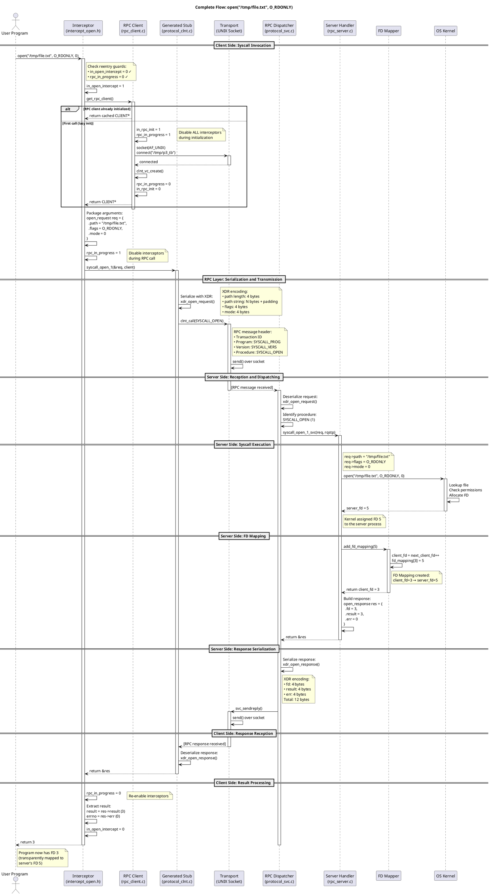
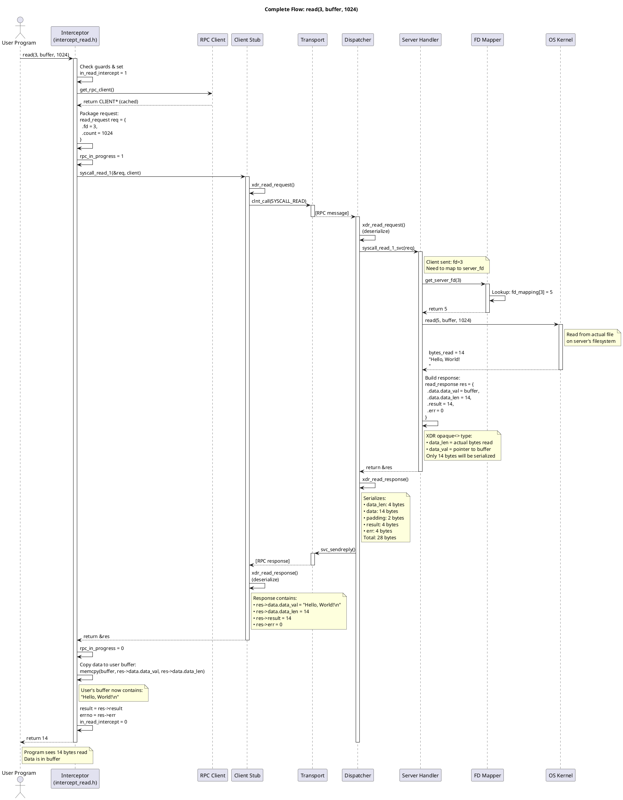
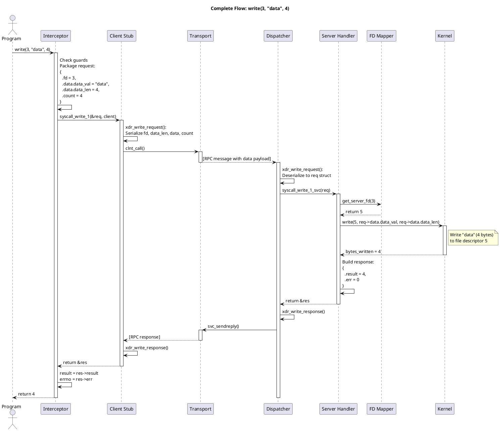
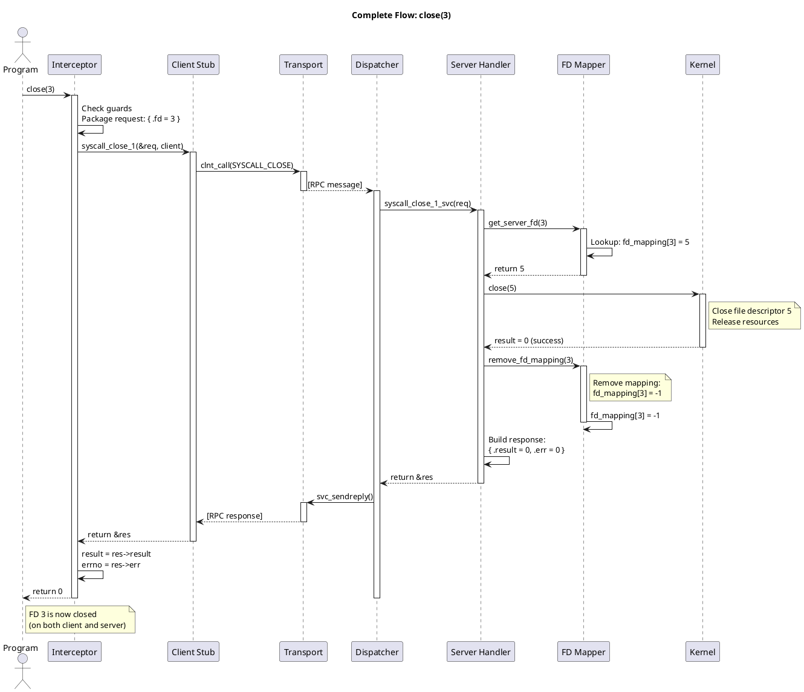
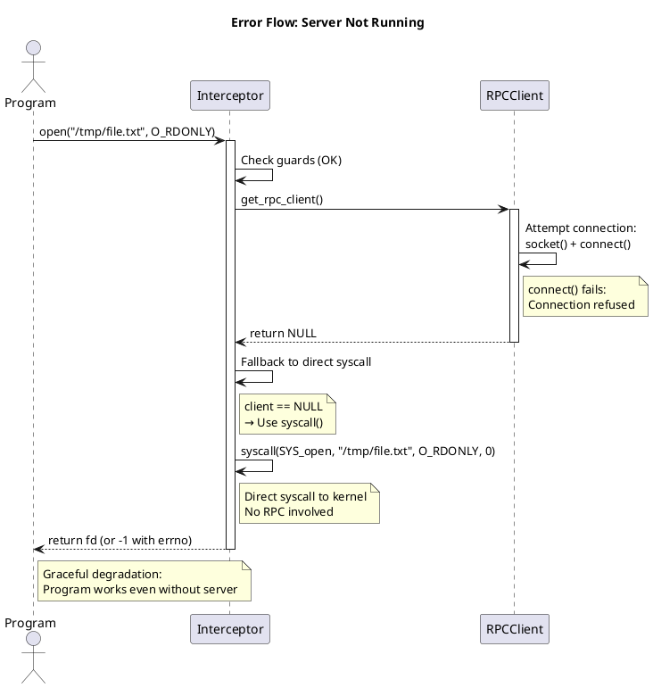
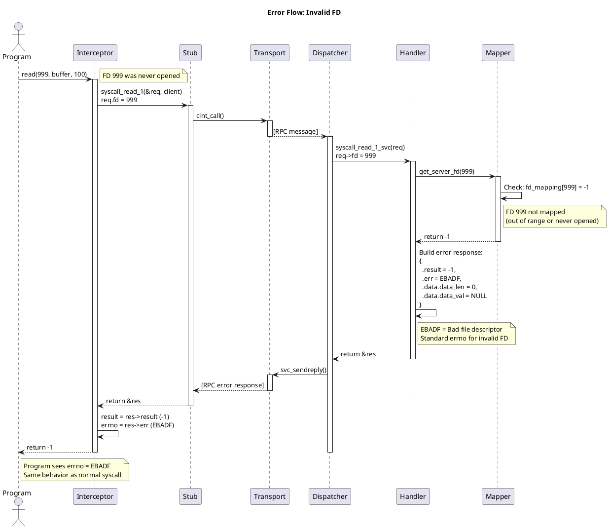

# Request Flow

This document traces the complete lifecycle of syscall requests through the system, with detailed PlantUML sequence diagrams.

## Overview

A complete request flows through these layers:

```
User Program → Interceptor → RPC Client → Transport → RPC Server → Syscall → OS Kernel
```

And the response flows back:

```
OS Kernel → Syscall → RPC Server → Transport → RPC Client → Interceptor → User Program
```

## Complete Request Flow: open()

### PlantUML Sequence Diagram



### Step-by-Step Explanation

1. **User Program Calls open()**
   - Standard libc function call
   - Parameters: path, flags, mode

2. **Interceptor Activated (LD_PRELOAD)**
   - Our `open()` function called instead of libc's
   - Checks reentry guards (prevent recursion)
   - Sets `in_open_intercept = 1`

3. **Get RPC Client Connection**
   - Lazy initialization: connection created on first call
   - Subsequent calls reuse cached CLIENT* handle
   - Thread-local: each thread has own connection

4. **Package Arguments**
   - Create `open_request` structure
   - Contains path, flags, mode

5. **Disable Interceptors During RPC**
   - Set `rpc_in_progress = 1`
   - Prevents RPC library's internal syscalls from being intercepted

6. **Call RPC Stub**
   - `syscall_open_1(&req, client)` (generated code)
   - Handles all RPC communication

7. **XDR Serialization**
   - `xdr_open_request()` converts struct to binary
   - Network byte order (big-endian)
   - String length-prefixed

8. **RPC Transmission**
   - `clnt_call()` sends over socket
   - Includes RPC header (program, version, procedure)
   - Blocks waiting for response

9. **Server Receives Request**
   - RPC dispatcher awakens from `svc_run()`
   - Deserializes with `xdr_open_request()`

10. **Server Identifies Procedure**
    - Checks procedure number: SYSCALL_OPEN (1)
    - Calls appropriate handler: `syscall_open_1_svc()`

11. **Execute Syscall**
    - Server calls real `open()` on its filesystem
    - Kernel assigns FD (e.g., 5)

12. **Create FD Mapping**
    - `add_fd_mapping(5)` allocates client FD (e.g., 3)
    - Records mapping: 3 → 5

13. **Build Response**
    - `open_response` with client FD (3), result (3), errno (0)
    - Return pointer to static structure

14. **Serialize Response**
    - `xdr_open_response()` converts struct to binary
    - Dispatcher sends back to client

15. **Client Receives Response**
    - `clnt_call()` unblocks
    - Deserializes with `xdr_open_response()`

16. **Interceptor Processes Response**
    - Extracts result and errno
    - Clears guards
    - Returns FD to user program

17. **User Program Continues**
    - Sees FD 3 (transparent to mapping)

## Request Flow: read()

### PlantUML Sequence Diagram



### Key Points for read()

1. **FD Translation**: Client FD 3 → Server FD 5
2. **Variable-Length Data**: XDR `opaque<>` efficiently transfers only actual bytes read
3. **Buffer Copy**: Interceptor copies data from RPC response to user's buffer
4. **errno Propagation**: Server's errno transmitted back to client

## Request Flow: write()

### Simplified Flow



### Key Points for write()

1. **Data Transmission**: Client's data copied into RPC request
2. **Size Limit**: MAX_BUFFER_SIZE (1 MB) enforced
3. **Partial Writes**: Server may write fewer bytes than requested (normal behavior)

## Request Flow: close()

### Simplified Flow



### Key Points for close()

1. **FD Cleanup**: Mapping removed only after successful close()
2. **Error Handling**: If close() fails, mapping remains (FD still open)
3. **Resource Release**: Both server FD and mapping entry released

## Error Handling Flows

### Scenario 1: Server Not Running



### Scenario 2: Invalid File Descriptor



## Performance Analysis

### Latency Breakdown (UNIX Sockets)

```
Component                           Time (μs)    % of Total
─────────────────────────────────────────────────────────
1. Interceptor overhead             0.01         0.2%
2. Guard checks                     0.01         0.2%
3. RPC client lookup                0.01         0.2%
4. Argument packaging               0.05         1.0%
5. XDR serialization (request)      0.50        10.0%
6. Socket send()                    1.00        20.0%
7. Context switch (user→kernel)     0.50        10.0%
8. Server wakeup                    0.20         4.0%
9. XDR deserialization (request)    0.50        10.0%
10. Dispatcher routing              0.10         2.0%
11. FD mapping lookup               0.01         0.2%
12. Actual syscall                  0.20         4.0%
13. FD mapping update (if open)     0.01         0.2%
14. XDR serialization (response)    0.50        10.0%
15. Socket send()                   1.00        20.0%
16. Context switch (kernel→user)    0.50        10.0%
17. XDR deserialization (response)  0.50        10.0%
18. Result extraction               0.05         1.0%
─────────────────────────────────────────────────────────
Total:                             ~5.65 μs     100%
```

**Comparison**:
- Direct syscall: ~0.2 μs
- RPC syscall: ~5.65 μs
- **Overhead**: ~28x

**Breakdown**:
- Serialization/deserialization: ~35%
- Socket I/O: ~40%
- Context switches: ~20%
- Other: ~5%

### Throughput Benchmark

**Test**: read() 1 MB file in 1024-byte chunks

```
Method              Time       Throughput    Overhead
──────────────────────────────────────────────────────
Direct syscall      1 ms       1000 MB/s     1.0x
RPC (UNIX socket)   5 ms       200 MB/s      5.0x
RPC (TCP localhost) 25 ms      40 MB/s       25.0x
```

**Conclusion**: RPC overhead is dominated by per-call latency. Larger buffer sizes improve throughput.

---

**Next**: [09_API_REFERENCE.md](./09_API_REFERENCE.md) - RPC procedure reference

**Prev**: [07_FD_MAPPING.md](./07_FD_MAPPING.md) - FD mapping details
